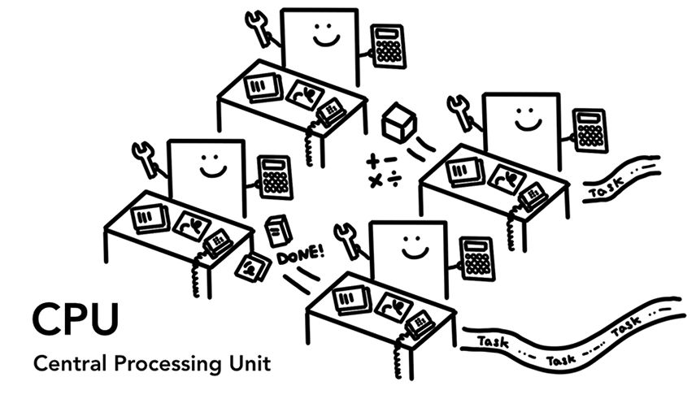
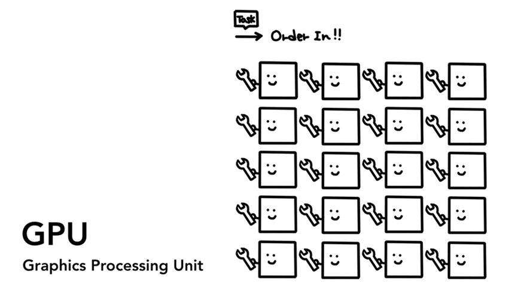
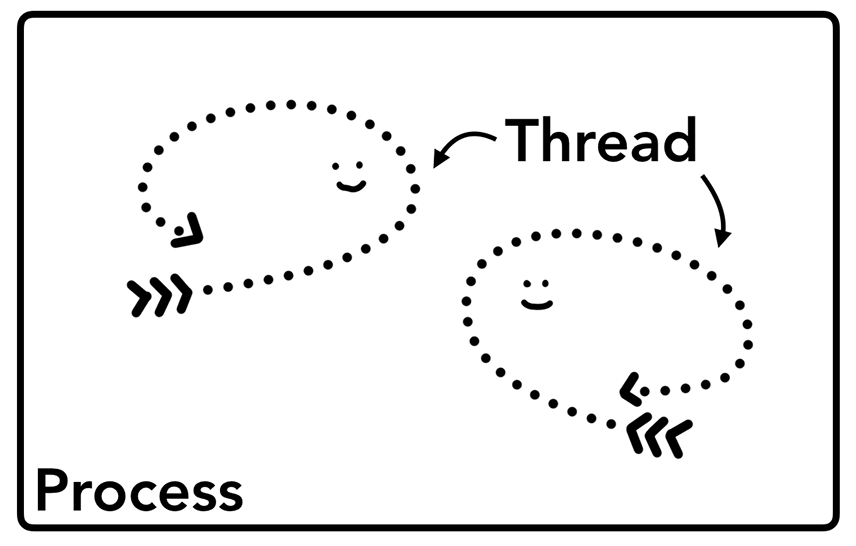
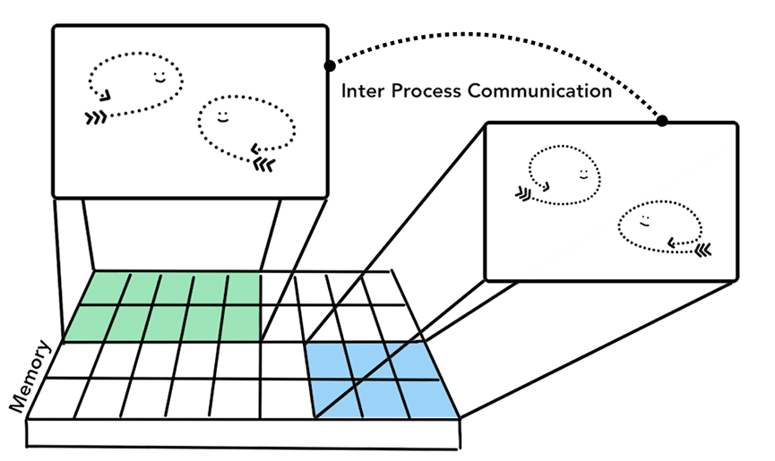
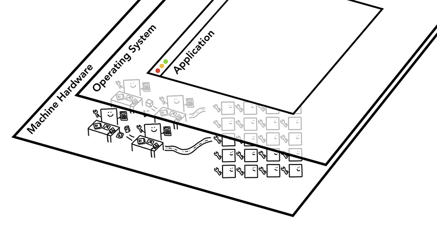

# 基本概念

## 1、CPU（中央处理器）

计算机系统的运算和控制核心，用于解释计算机指令以及处理计算机软件中的数据，是信息处理、程序运行的最终执行单元。

## 2、GPU（图形处理器）

进行图像和图形相关运算工作的处理器，通常被集成在显卡中，独立于中央处理器。

## 3、Process、Thread（进程、线程）

应用程序启动时，操作系统会为其创建一个进程，进程是程序的一次执行过程。一个进程中可以包含一个或多个线程。线程是 CPU 的最小执行单位。

## 4、IPC（进程通信、Inter Process Communication）

进程根据需要，会让操作系统创建新的进程，用于处理不同的任务。新创建的进程拥有自己独立的内存空间。进程与进程之间通过 IPC 进行通信。

## 5、计算机三层架构

应用程序依赖于操作系统，操作系统依赖于硬件机器。

## 6、参考
- [窥探现代浏览器架构(一)](https://cloud.tencent.com/developer/article/2079049)