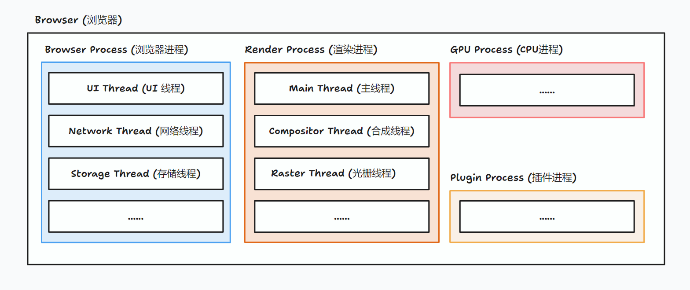

# 浏览器组成

## 1、浏览器内部结构

浏览器是多进程应用。其中主要进程包括：**浏览器进程**、**渲染进程**、**GPU 进程**、**插件进程**。

- 浏览器进程

| 
 线程
 | 主要功能                                                                              |
| :------------------------------------: | ------------------------------------------------------------------------------------- |
|              **UI 线程**               | 负责浏览器 tab 之外的视图控制，如导航栏，书签， 前进和后退按钮                        |
|              **网络线程**              | 进行网络通信（Chrome 进行服务化后，在高性能的硬件中，会被拆成一个进程，变成网络进程） |
|              **存储线程**              | 负责存储相关功能，如文件的读写                                                        |

- 渲染进程

| 
 线程
 | 主要功能                                                                                                           |
| :------------------------------------: | ------------------------------------------------------------------------------------------------------------------ |
|               **主线程**               | 负责解析 HTML、CSS、JavaScript                                                                                     |
|              **合成线程**              | 对主线程解析获取并传递过来的**层次树**和**绘制顺序**，进行光栅化每一个图层，并切成一块有一块的**图块**交由光栅线程 |
|              **光栅线程**              | 栅格化每个**图块**并且把它们存储在 GPU 的内存中                                                                    |

## 2、参考

- [现代浏览器 - 深入理解](https://blackpearl.fun/zh/technology/web/inside-look-at-browser)
- [窥探现代浏览器架构(二)](https://cloud.tencent.com/developer/article/2079051)
- [窥探现代浏览器架构(三)](https://cloud.tencent.com/developer/article/2079053)
- [窥探现代浏览器架构(四)](https://cloud.tencent.com/developer/article/2079054)
