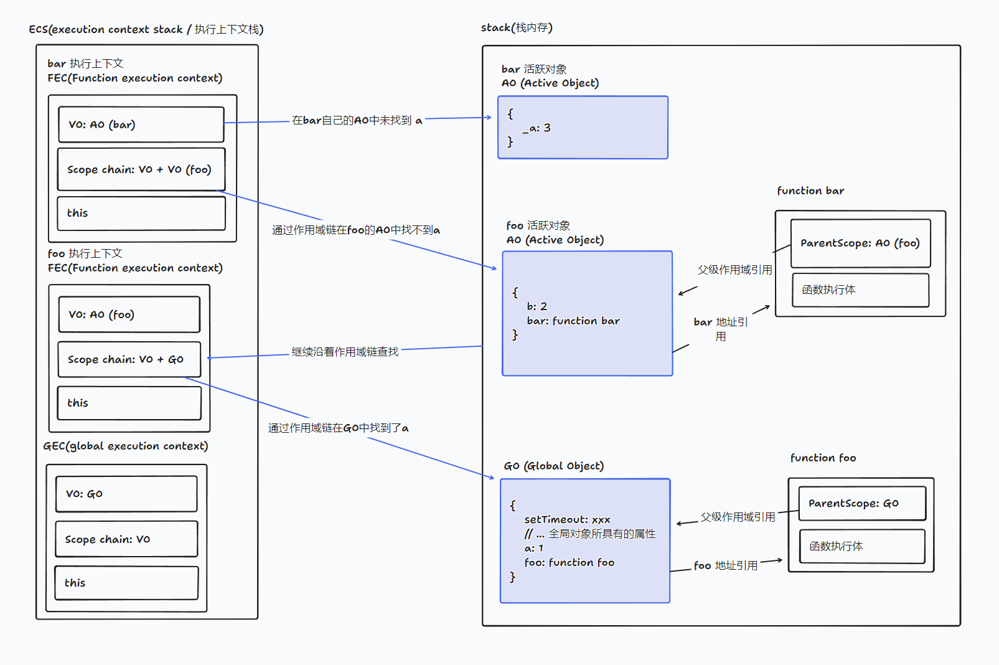

# 作用域、执行上下文、作用域链

## 1. 作用域

作用域指的是变量的可见区域，即变量在什么范围内可以被访问。在 ES6 之前，作用域分为：**全局作用域**和**函数作用域**。在 ES6 中，新增了**块级作用域**。

## 2. 执行上下文

在 javascript 中，代码的执行是由 **执行上下文栈** 又称 **调用栈** 维护的，执行上下文栈存放着代码执行所需要的 **执行上下文** 。

- 执行上下文分为：**全局执行上下文**、**函数执行上下文**、**eval 函数执行上下文**。

- 执行上下文栈是一个栈结构，先进后出，在栈底永远是全局执行上下文。

- 执行上下文分为 **创建阶段** 和 **执行阶段**。

> 在执行全局代码时，会将全局执行上下文压入栈底，执行函数时，会创建函数执行上下文，压入栈中，当函数执行完毕时，该函数的执行上下文将弹出栈。

在执行上下文创建阶段，会创建**变量对象**（在新的 ECMAScript 标准中称为**变量环境**）、**作用域链**、**this** 等。

### 2.1. 示例

```js
console.log(a); // undefined

var a = 1;

foo(); // foo
function foo() {
  console.log("foo");
}
```

1. 创建阶段内存示意图
   
   创建执行上下文的**变量对象**收集过程：

   - 在全局执行上下文中，**收集变量声明和函数声明**，将变量声明和函数声明作为属性添加到变量对象中。

   - 在函数执行上下文中，**收集 arguments、参数、变量声明、函数声明**，作为属性添加到变量对象中。

   - 收集过程中，**如果是参数、变量声明，则将变量对象对应的属性值设置为 `undefined`。如果是函数声明，则将变量对象对应的属性值设置为函数的引用**， 函数存放着执行体与当前作用域（vo）。

2. 执行上下文执行阶段，顺序执行代码，在执行过程中，会对变量对象进行**查找**，如果找到，则直接使用变量对象对应的属性值，如果找不到，则会报错。

   - 执行 `console.log(a)`，在变量对象中找到，输出 `undefined`。

   - 执行 `var a = 1`，在变量对象中找到，将变量对象对应的属性 `a` 设置为 `1`。

   - 执行 `foo()`，在变量对象中找到 `foo`, 执行 `foo`, 输出 `foo`。

   执行之后内存结构为：
   

## 3. 作用域链

每个执行上下文都有一个 **作用域链**，作用域链是一个链表结构，指向了 `变量对象` 与 `父级作用域` 组成的链表。作用域链的作用是在当前执行上下文中查找变量，如果找不到，则沿着作用域链向上查找，直到找到或者找到全局执行上下文为止。

### 3.1 示例

```js
var a = 1;
function foo() {
  var b = 2;
  function bar() {
    var _a = 3;
    console.log(_a); // 3
    console.log(b); // 2
    console.log(a); // 1
  }

  bar();
}
```

`_a` 在 `bar` 的执行上下文中找到，输出 `3`，`b` 在 `foo` 的执行上下文中找到，输出 `1` ，`a` 在全局执行上下文中找到，输出 `2`。

在执行到`bar`时，其内存示意图为：


开始执行：

1. 执行 `var _a = 3`, 将 `bar` 产生的 `AO` 对象中的 `_a` 属性设置为 `3`。

   

2. 执行 `console.log(_a)`, `_a` 在 `bar` 的 `AO` 对象中找到，输出 `3`。

3. 执行 `console.log(b)`, `b` 在 `bar` 的 `AO` 对象中找不到，沿着作用域链向上查找，在 `foo` 的 `AO` 对象中找到，输出 `2`。查找示意图：

   

4. 执行 `console.log(a)`, `a` 在 `bar` 的 `AO` 对象中找不到，沿着作用域链向上查找，在 `foo` 的 `AO` 对象中找不到，继续沿着作用域链向上查找，在全局执行上下文中找到，输出 `1`。查找示意图：

   
