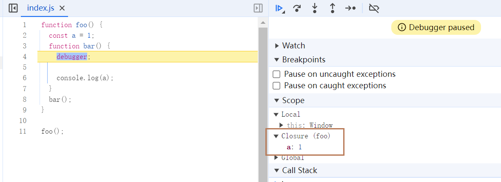
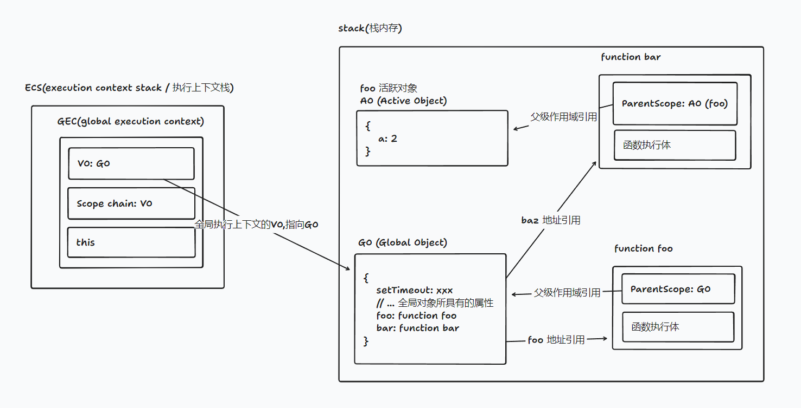
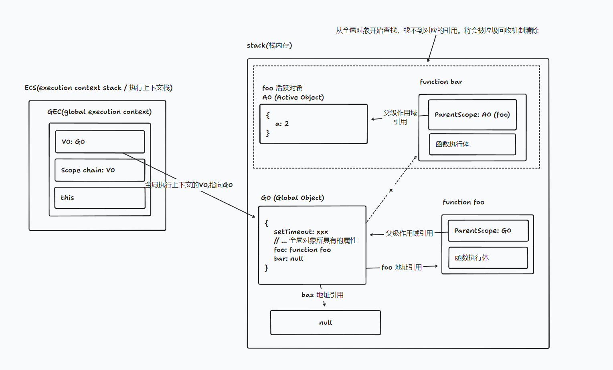
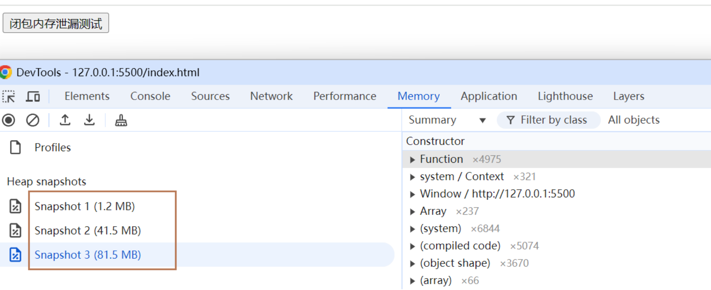
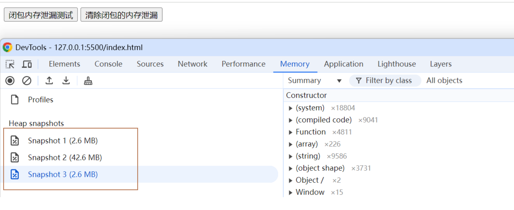

# 闭包

## 1. 基本概念

一个函数及其周围环境状态（词法环境）的引用组成的整体就是闭包。**简单的来说，就是当一个函数内访问了其外部作用域中的变量时，这个函数和其访问的外部作用域中的变量一起组成了闭包**。

> MDN 解释： 闭包（closure）是一个函数以及其捆绑的周边环境状态（lexical environment，词法环境）的引用的组合。换而言之，闭包让开发者可以从内部函数访问外部函数的作用域。在 JavaScript 中，闭包会随着函数的创建而被同时创建。[原文](https://developer.mozilla.org/zh-CN/docs/Web/JavaScript/Closures)

### 1.1. 示例

```js
function foo() {
  const a = 1;
  function bar() {
    console.log(a);
  }
  bar();
}

foo();
```

函数 `bar` 因为访问了 `foo` 作用域中的变量 `a`，所以 `bar` 与 `a` 组成了闭包。在浏览器中调试显示的如下:



## 2. 闭包的作用

### 2.1 私有化变量

```js
function foo() {
  const a = 1;
  function bar() {
    console.log(a);
  }
  return bar;
}

const baz = foo();
baz();
```

通过使用闭包，将变量 `a` 私有化，外部无法访问。

### 2.2 延长变量的生命周期

在函数中定义的变量，在函数执行完毕后，会被销毁。借助闭包，将变量保存在内存中，从而延长变量的生命周期。

### 2.3 在循环中使用闭包

```js
for (var i = 0; i < 5; i++) {
  setTimeout(function () {
    console.log(i);
  }, 1000);
}
```

如上代码，期望输出 `0,1,2,3,4`，但是实际输出 `5,5,5,5,5`。这是因为 `setTimeout` 是异步任务，会在循环结束后执行。在循环结束后，变量 `i` 的值为 `5`，所以输出 `5,5,5,5,5`。

但是可以通过使用闭包，将变量 `i` 保存在内存中，从而实现期望输出。实现如下：

```js
for (var i = 0; i < 5; i++) {
  (function (i) {
    setTimeout(function () {
      console.log(i);
    }, 1000);
  })(i);
}
```

## 3. 闭包照成的内存泄漏及解决方案

### 3.1. 内存泄漏分析

```js
function foo() {
  const a = 1;
  function bar() {
    console.log(a);
  }
  return bar;
}

const baz = foo();
baz();
```

上述代码执行完毕之后的内存示意图：



从内存指向来看，上述代码执行过后，全局对象上存在 `baz` 指向了 函数 `bar`, 而函数 `bar` 存在执行了 `foo` 产生的 `VO`的指向。从而**照成 `foo`执行完毕后，其对应的 `VO` 没有被销毁，导致内存泄漏**。

### 3.2. 解决方案

因为在 `V8` 引擎中的**垃圾回收机制**采用的是**标记清除**，所以我们只要使从全局对象中开始查找，找不到对应的不应该被保存的`vo`对象即可。


如上述内存图所示。我们只要将 `baz` 赋值为 `null` 即可将 `baz` 对 `bar` 的指向去掉。而后 foo 对应的 本该消除的 VO 对象 就会被垃圾回收器清除，从而解决了闭包内存泄漏问题



### 3.3. 内存泄漏测试

#### 3.3.1 内存泄漏演示

```html
<!DOCTYPE html>
<html lang="en">
  <head>
    <meta charset="UTF-8" />
    <meta name="viewport" content="width=device-width, initial-scale=1.0" />
    <title>Document</title>
  </head>

  <body>
    <button id="app">闭包内存泄漏测试</button>

    <script>
      var app = document.getElementById("app");

      function handleClickFnFactory() {
        var arr = new Array(100000).fill(123);
        var handleClickFn = function (e) {
          console.log("arr", arr);
        };
        return handleClickFn;
      }

      var arr = [];
      app.addEventListener("click", () => {
        for (let i = 0; i < 100; i++) {
          arr.push(handleClickFnFactory());
        }

        arr.forEach((item) => item());
      });
    </script>
  </body>
</html>
```

对应的内存快照如下所示：


通过快照可以发现，每点击一次，内存就会增加内存大小。

#### 3.3.2 内存泄漏解决方案演示

```html
<!DOCTYPE html>
<html lang="en">
  <head>
    <meta charset="UTF-8" />
    <meta name="viewport" content="width=device-width, initial-scale=1.0" />
    <title>Document</title>
  </head>

  <body>
    <button id="app">闭包内存泄漏测试</button>
    <button id="app2">清除闭包的内存泄漏</button>

    <script>
      var app = document.getElementById("app");
      var app2 = document.getElementById("app2");

      function handleClickFnFactory() {
        var arr = new Array(100000).fill(123);
        var handleClickFn = function (e) {
          console.log("arr", arr);
        };
        return handleClickFn;
      }

      var arr = [];
      app.addEventListener("click", () => {
        for (let i = 0; i < 100; i++) {
          arr.push(handleClickFnFactory());
        }
      });

      app2.addEventListener("click", () => {
        arr = [];
      });
    </script>
  </body>
</html>
```



当点击【清除闭包的内存泄漏】时，闭包所产生的内存泄漏就被垃圾回收器回收了
