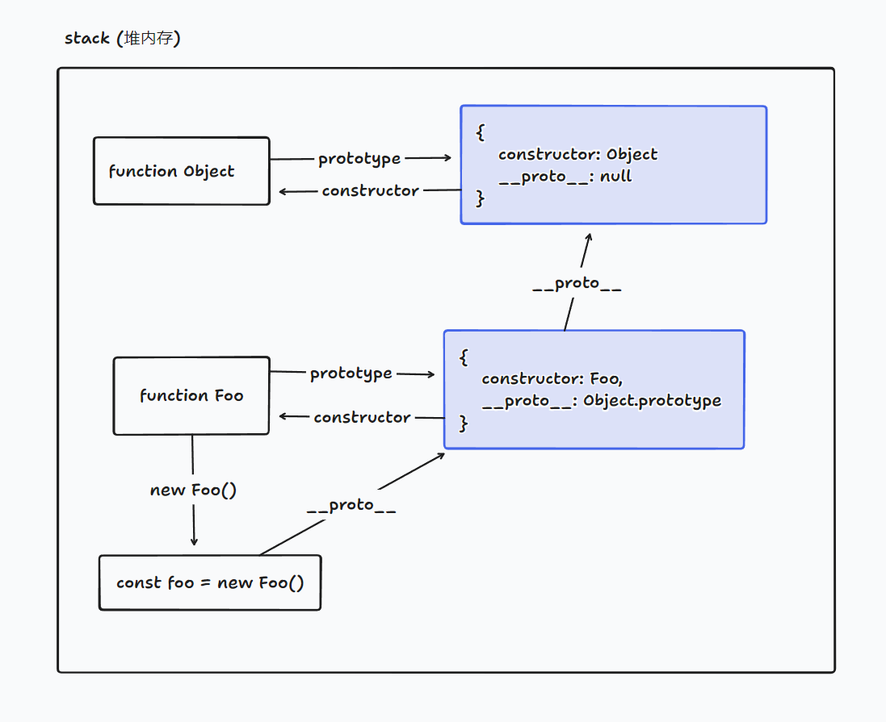

# 原型、原型链

## 1. 原型

在 js 中，每个函数都有一个 prototype 属性，这个属性指向一个对象，这个对象就是函数的原型，称为**显式原型**。原型对象上存在 `constructor` 属性，指向了这个函数本身。

```js
function Foo() {}

// Foo 函数的prototype 属性指向的对象，就是函数的原型
console.log(Foo.prototype); // {}
```

- 内存示意图


## 2. 原型链

在 js 中，每个对象都有一个 [[prototype]] 属性， 称为**隐式原型**，这个属性指向了该对象的 **构造函数的原型**。在大多数浏览器中，可通过 `__proto__` 访问该属性。`__proto__` 存在兼容性问题。在开发中，应使用 `Object.getPrototypeOf()` 方法来获取对象的原型。

```js
function Foo() {}

const foo = new Foo();

console.log(foo.__proto__ === Foo.prototype); // true
console.log(Object.getPrototypeOf(foo) === Foo.prototype); // true

console.log(foo.name); // undefined
```

显式原型本身也是一个对象，所以它也有自己的原型。因此就会存在原型的原型，从而形成了一个原型链。一个原型链的终点是`Object.prototype`, 它的原型为 `null`。

当访问对象的属性时，如果对象本身没有该属性，则会去对象的原型上查找该属性。如果原型上也没有该属性，则会沿着原型链上查找，直到找到该属性或者到达原型链的末尾。

- 内存示意图


